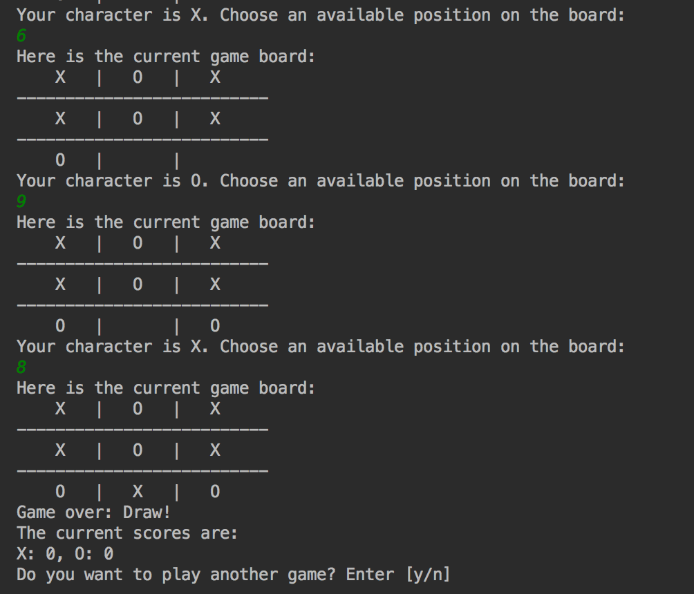

# Outline

Great job for completing your first game using Ruby! It's time to take it to the next level. It's time to dive deeper into the world of __Object Oriented Programming__ also known as __OOP__ and learn more about Ruby.  
In this chapter, we will explore the 3 fundamental concepts that are Encapsulation, Inheritance and Polymorphism. Afterwards, we're going to get started on our second challenge which is to make a tic-tac-toe game.

## Prerequisites:

* You should be familiar with the concepts taught in chapter 1
* Finished creating and beat your quiz game!!!
* __A lot more enthusiasm!!!__

## What you will learn in this tutorial:

* Program in the modern way - OOP.
* Working with classes and objects
* Modelling your program
* Creating a tic-tac-toe game

